# Serena Blake — Therapist Portfolio Website


A clean, accessible, and mobile-first therapist portfolio website built for Dr. Serena Blake, a licensed clinical psychologist based in Los Angeles. Designed and developed as a case study project using modern technologies including **Next.js**, **Tailwind CSS**, and **TypeScript**.

> This project showcases a fully responsive and elegant personal brand site optimized for performance and accessibility.

---

## 🌐 Live Preview

[🔗 Visit Live Site](https://your-deployed-site-url.com)

---

## 🛠 Tech Stack

- **Framework:** [Next.js](https://nextjs.org)
- **Styling:** [Tailwind CSS](https://tailwindcss.com)
- **Language:** [TypeScript](https://www.typescriptlang.org)
- **Font Optimization:** [Geist (next/font)](https://vercel.com/font)
- **Hosting:** [Vercel](https://vercel.com)

---

## 📸 Screenshots

### 🖥️ Desktop View

| d1.png | d2.png | d3.png |
|-------|--------|--------|
| 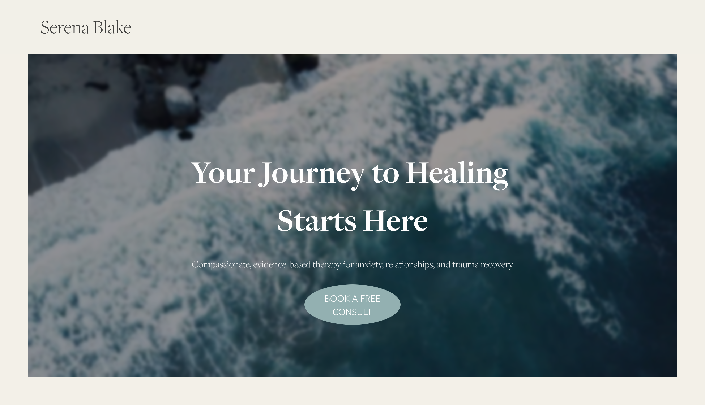 | 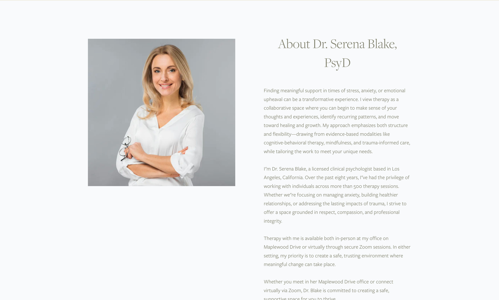 | 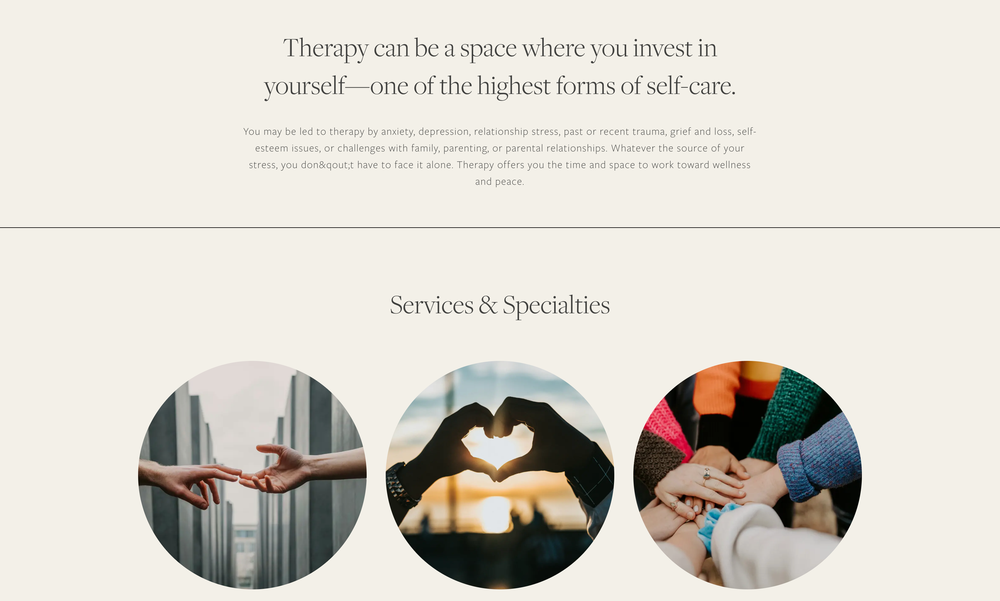 |

| d4.png | d5.png | d6.png |
|-------|--------|--------|
| 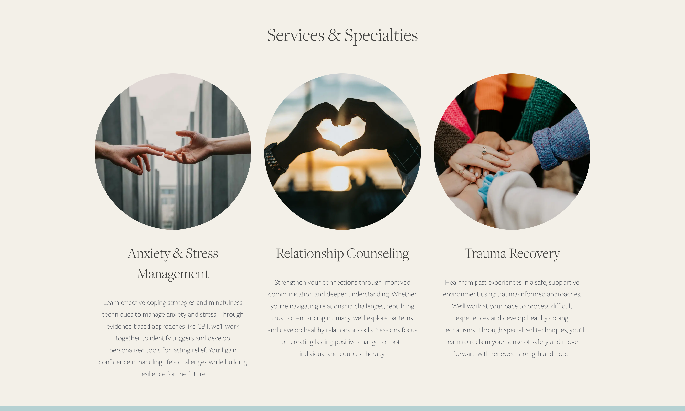 | 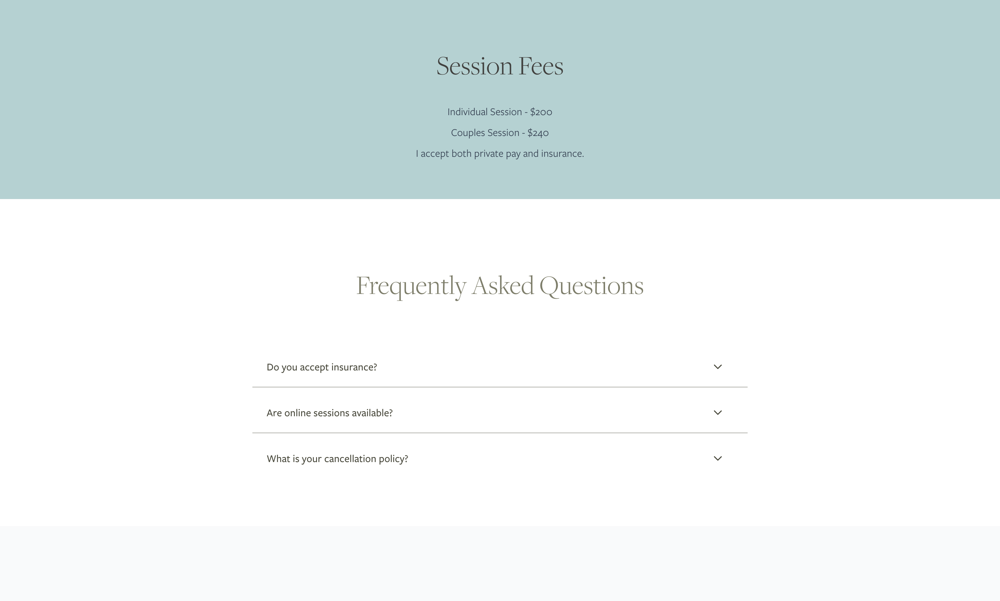 | 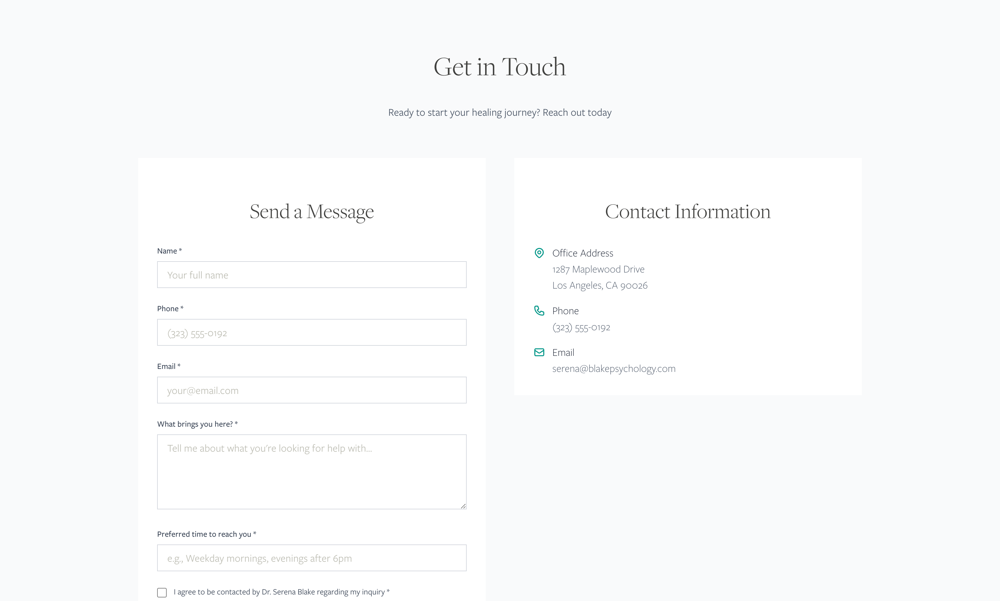 |

| d7.png |
|--------|
| 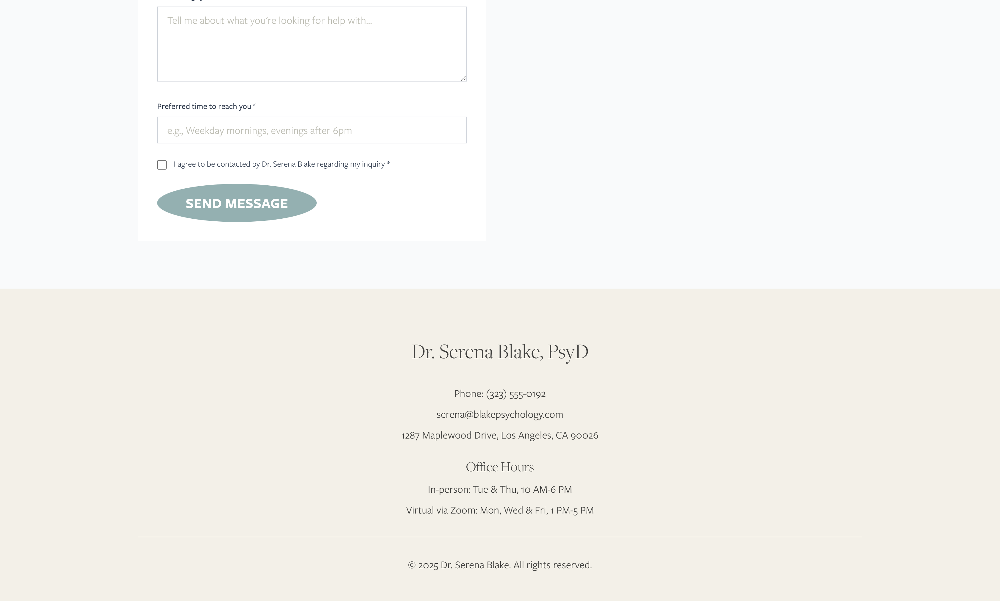 |

---

### 📱 Mobile View

| m1.png | m2.png | m3.png |
|-------|--------|--------|
| 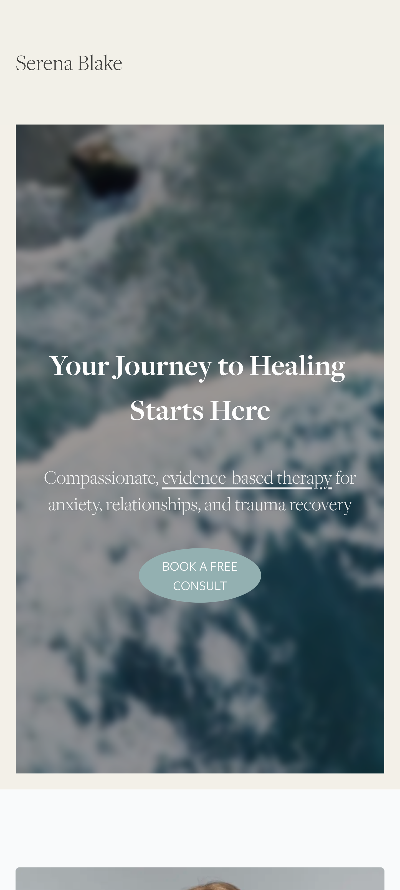 |  |  |

| m4.png | m5.png | m6.png |
|-------|--------|--------|
|  | 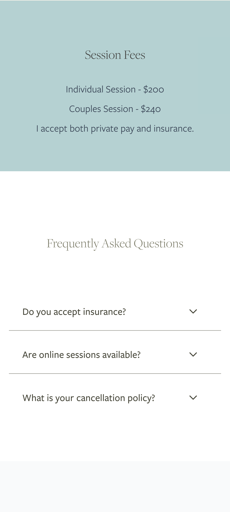 | 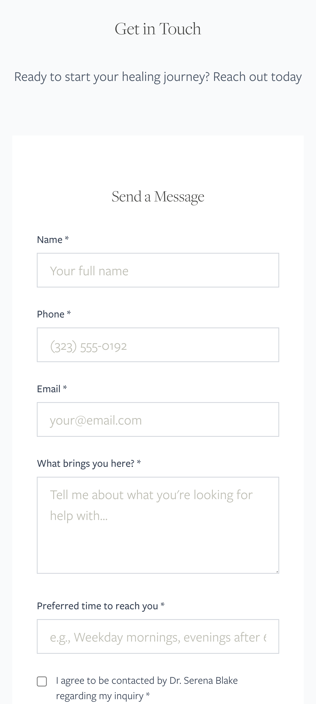 |

| m7.png |
|--------|
| 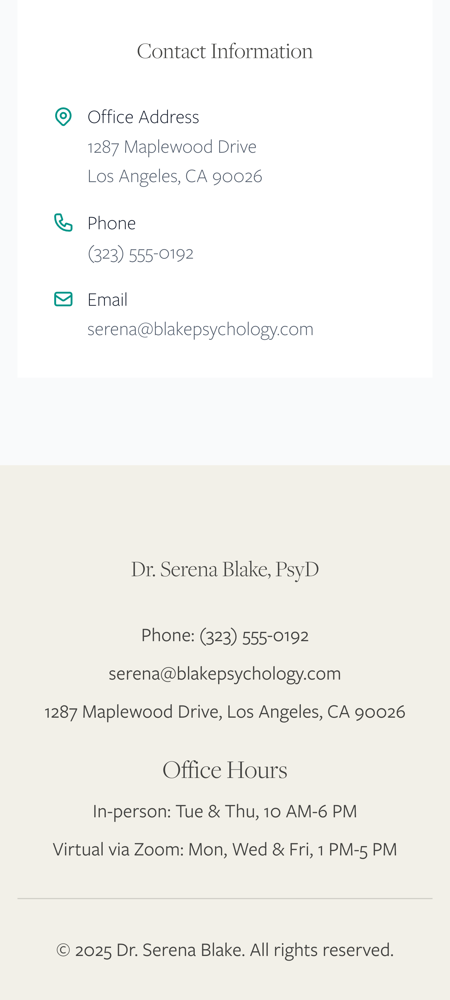 |

---

## 🚀 Getting Started

Install dependencies and run the development server:

```bash
# Install dependencies
npm install

# Start the development server
npm run dev
# or
yarn dev
# or
pnpm dev
# or
bun dev
````

Then open [http://localhost:3000](http://localhost:3000) to view it in the browser.

You can start editing the homepage by modifying `app/page.tsx`. Changes are reflected instantly.

---

## 📚 Learn More

* [Next.js Documentation](https://nextjs.org/docs)
* [Tailwind CSS Documentation](https://tailwindcss.com/docs)
* [TypeScript Docs](https://www.typescriptlang.org/docs/)

---

## 🧪 Deployment

This project is optimized for deployment on [Vercel](https://vercel.com), the official hosting provider for Next.js.

Follow the [Next.js deployment guide](https://nextjs.org/docs/app/building-your-application/deploying) to get started.

---

## 📄 License

This project is for educational and portfolio use only.

---

## 🙌 Acknowledgements

* Inspired by clean therapist portfolio layouts and accessibility-first design
* Fonts provided by [Vercel Fonts](https://vercel.com/font)
